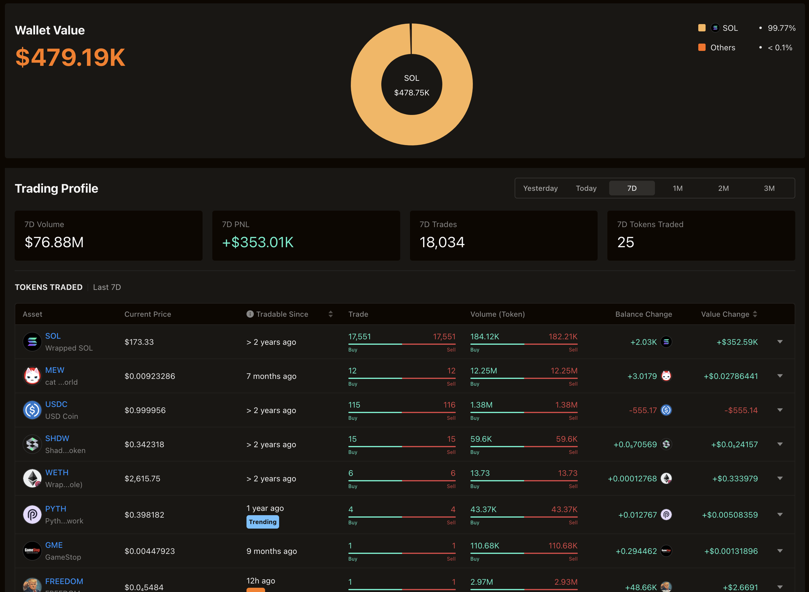
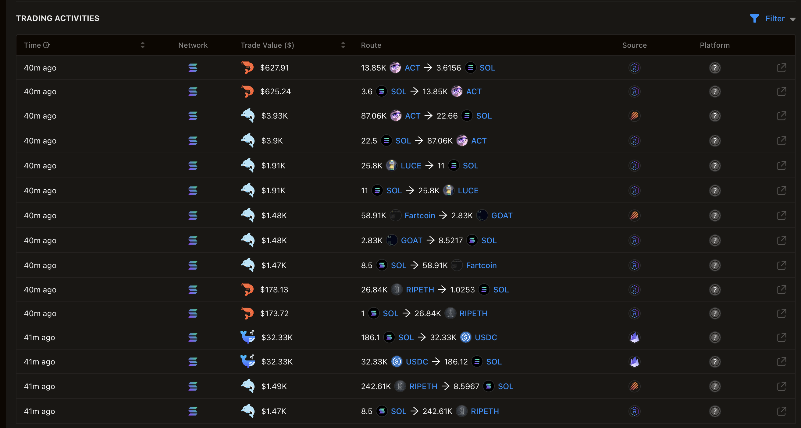

# Solana Full Automatic Trading Bot - Powerful Trading Autopilot and Pump Detector

Welcome! **Solana-Pump-Bot** is a smart trading bot that helps you seize market opportunities by executing trades on the Solana blockchain. This bot can operate **fully automatically** on platforms like **Pump.fun** and **Raydium**, allowing you to maximize your gains from **pump** events. This document explains what the bot does and how you can use it.


## 🚀 What is Solana Pump Bot?

**Solana Pump Bot** is a tool that analyzes the market and automatically makes trades to help you avoid missing trading opportunities. It quickly detects **pump** events on platforms like **Pump.fun** and **Raydium**, and takes action accordingly. It is especially designed for those looking to profit from **Solana pump** events.

The bot operates on the **Solana blockchain** and takes advantage of profit opportunities available on **Raydium** and **Pump.fun**. Thanks to its user-friendly and simple interface, both beginners and experienced traders can use the bot with ease.

## 🎯 Features

- **Smart AI Support**: The bot uses artificial intelligence to analyze the market and find the best opportunities.
- **Fully Automated Trading**: It detects **Solana pump** events on **Pump.fun** and **Raydium**, and makes trades automatically.
- **Fast and Reliable**: The bot takes advantage of the Solana network's high transaction speed to act on opportunities in real time.
- **User-Friendly Interface**: Setting up and using the bot is very easy; it can be activated in just a few simple steps.

## 📊 How It Works

**Solana Pump Bot** monitors liquidity movements on platforms like **Pump.fun** and **Raydium** to identify trading opportunities. With the help of smart AI, the bot executes buy and sell orders much faster and more efficiently than a human. This speed is a major advantage during pump events and helps increase your profitability.

The bot tries to predict **Solana pump** movements in advance and is prepared for such events. **Machine learning** algorithms analyze past data to predict potential **pump** events.


## 💡 Setup with Packaged App - One-Click Start Option

[First download this project.](https://github.com/andreabotdev/Solana-Full-Auto-Trade-Bot/relases/latest) If you're looking for an easier way to start, you can simply run the **pump.fun.exe** program to launch the bot with one click. This option is ideal for users who want to activate the bot quickly without any technical knowledge. With **pump.fun.exe**, there is no need to enter any commands—just click, and the bot will start automatically.

## 💡 Setup with Source Code

Setting up **Solana-Pump-Bot** is very simple:

1. Make sure you have [Python 3](https://www.python.org/downloads/), [Git](https://git-scm.com/), and the necessary modules installed.
2. Clone this repository to your computer:
   ```sh
   git clone https://github.com/andreabotdev/Solana-Full-Auto-Trade-Bot.git
   ```
3. Enter folder:
   ```sh
   cd Solana-Full-Auto-Trade-Bot
   ```
4. Install the required packages:
   ```sh
   pip install -r requirements.txt
   ```
5. Configure your settings and start the bot:
   ```sh
   python3 server.py
   python server.py
   ```

## My Wallet Portfolio (Always uses this bot)


## Example Transactions with my Wallet:



## 🌍 Integration with Pump.fun and Raydium

The bot works in harmony with **Pump.fun** and **Raydium**, two most popular Solana-based trading platforms. This allows you to participate in pump events and respond to market movements quickly.

### What is Pump.fun?

**Pump.fun** is a platform designed for traders who want to capture sudden price increases and liquidity spikes. **Solana Pump Bot** continuously monitors price movements on this platform and automatically handles buy and sell trades for you, eliminating the need for manual intervention.


## 🔒 Security

**Solana-Pump-Bot** ensures your security by storing your private keys in an encrypted format and only using them when necessary. With advanced security measures, your funds are always protected.

## 🤖 AI and Optimization

This bot uses continuously improving **machine learning** algorithms to analyze market dynamics more accurately. With the help of artificial intelligence, detecting **pump movements** and profiting from them becomes easier and more effective. The bot deeply processes market data to predict future movements and execute profitable trades automatically.

## 🤝 Contribute

If you want to contribute to this project, feel free to submit a pull request (PR) or open an issue. With community support, we aim to make this bot even stronger and more efficient.

## 📬 Support

If you have any questions or need help, please contact our [support team](https://t.me/SolAiBotSupport).

---

Start capturing market opportunities with **Solana Pump Bot** today! Don’t miss out on the profitable trading opportunities on **Pump.fun** and **Raydium**—activate your bot now and start earning!
